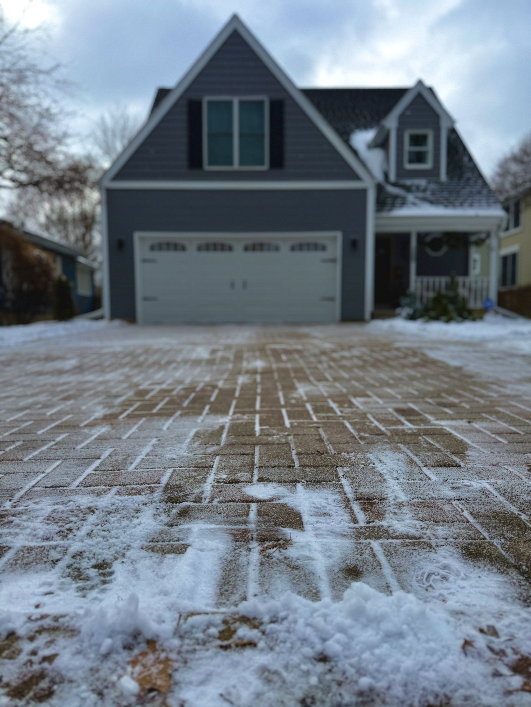

Nothing serious — just something I got into this past winter. I took some photos around the house and on walks, then messed around with the iPhone's editing tools to bring out colors that stuck out to me.

I watched a few videos on how to color photos well. Mostly just curious about what the sliders actually do and how small tweaks change the mood of a shot.

Here are a few I liked.

